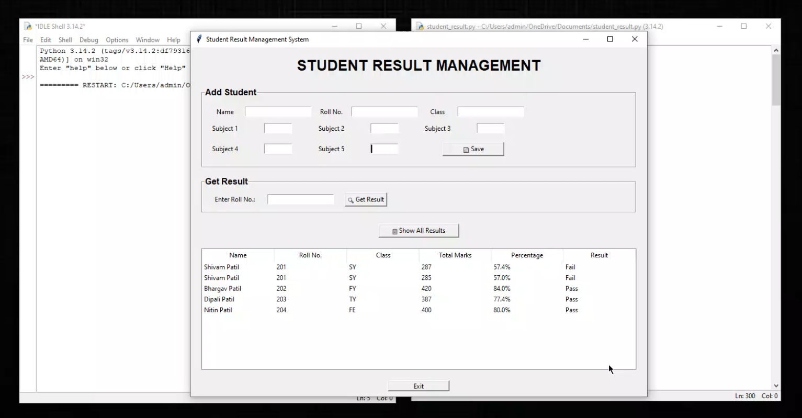

# 🎓 Student Result Management System

A simple Student Result Management System developed using Python Tkinter and Excel.

## 📌 Features

- Add student details
- Enter marks for 5 subjects
- Calculate total marks
- Calculate percentage
- Calculate Pass/Fail result
- Search result using Roll No.
- Show all student results
- Store student data in Excel

## 🛠️ Technologies Used

- Python
- Tkinter
- OpenPyXL
- Excel

## 📂 Project File

- student_result.py - Main Python program
- student_results.xlsx - Stores student results

## ▶️ How to Run

Install OpenPyXL:

pip install openpyxl

Run the program:

python student_result.py

## 📸 Project Screenshot

